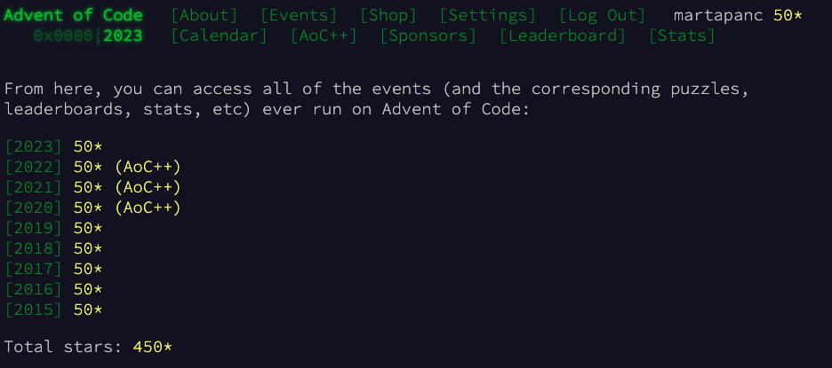

# 🎄 Advent of Code ⛄️

Collection of my solutions to the [AoC](https://adventofcode.com/) challenges (2015-2024)

## Quick links

- Advent of Code 2️⃣0️⃣2️⃣4️⃣ : [overview](2024/src/2024/README.md) & [solutions](2024/src/2024) - 26 / 50 ⭐️ &emsp;  
- Advent of Code 2️⃣0️⃣2️⃣3️⃣ : [overview](2015-2023/src/main/kotlin/aoc2023/README.md) & [solutions](2015-2023/src/main/kotlin/aoc2023) - 50 / 50 ⭐️ &emsp;  
- Advent of Code 2️⃣0️⃣2️⃣2️⃣ : [overview](2015-2023/src/main/kotlin/aoc2022/README.md) & [solutions](2015-2023/src/main/kotlin/aoc2022) - 50 / 50 ⭐️ &emsp;  
- Advent of Code 2️⃣0️⃣2️⃣1️⃣ : [overview](2015-2023/src/main/kotlin/aoc2021/README.md) & [solutions](2015-2023/src/main/kotlin/aoc2021) - 50 / 50 ⭐️ &emsp;  
- Advent of Code 2️⃣0️⃣2️⃣0️⃣ : [overview](2015-2023/src/main/kotlin/aoc2020/README.md) & [solutions](2015-2023/src/main/kotlin/aoc2020) - 50 / 50 ⭐️ &emsp;  
- Advent of Code 2️⃣0️⃣1️⃣9️⃣ : [overview](2015-2023/src/main/kotlin/aoc2019/README.md) & [solutions](2015-2023/src/main/kotlin/aoc2019) - 50 / 50 ⭐️ &emsp;  
- Advent of Code 2️⃣0️⃣1️⃣8️⃣ : [overview](2015-2023/src/main/kotlin/aoc2018/README.md) & [solutions](2015-2023/src/main/kotlin/aoc2018) - 50 / 50 ⭐️ &emsp;  
- Advent of Code 2️⃣0️⃣1️⃣7️⃣ : [overview](2015-2023/src/main/kotlin/aoc2017/README.md) & [solutions](2015-2023/src/main/kotlin/aoc2017) - 50 / 50 ⭐️ &emsp;  
- Advent of Code 2️⃣0️⃣1️⃣6️⃣ : [overview](2015-2023/src/main/kotlin/aoc2016/README.md) & [solutions](2015-2023/src/main/kotlin/aoc2016) - 50 / 50 ⭐️ &emsp;  
- Advent of Code 2️⃣0️⃣1️⃣5️⃣ : [overview](2015-2023/src/main/kotlin/aoc2015/README.md) & [solutions](2015-2023/src/main/kotlin/aoc2015) - 50 / 50 ⭐️ &emsp;  

 Total:  476 / 500 ⭐
 

 

