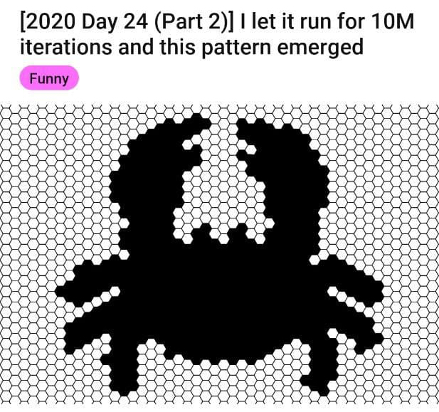

# 🌠 Advent of Code 2020 ⭐️

| Day  | Title | Code | Tests | Tags | Visual |
| ---- | ----- | ---- | ----- | ---- | ------ |
| [Day 1](https://adventofcode.com/2020/day/1)   | Report Repair                                       | [code](day01/Day1.kt) | [tests](../../../test/kotlin/aoc2020/day01/Day1KtTest.kt) |
| [Day 2](https://adventofcode.com/2020/day/2)   | Password Philosophy                                 | [code](day02/Day2.kt) | [tests](../../../test/kotlin/aoc2020/day02/Day2KtTest.kt) |
| [Day 3](https://adventofcode.com/2020/day/3)   | Toboggan Trajectory                                 | [code](day03/Day3.kt) | [tests](../../../test/kotlin/aoc2020/day03/Day3KtTest.kt) |
| [Day 4](https://adventofcode.com/2020/day/4)   | Passport Processing                                 | [code](day04/Day4.kt) | [tests](../../../test/kotlin/aoc2020/day04/Day4KtTest.kt) |
| [Day 5](https://adventofcode.com/2020/day/5)   | Binary Boarding                                     | [code](day05/Day5.kt) | [tests](../../../test/kotlin/aoc2020/day05/Day5KtTest.kt) | | [seat map](day05/seatMap) |
| [Day 6](https://adventofcode.com/2020/day/6)   | Custom Customs                                      | [code](day06/Day6.kt) | [tests](../../../test/kotlin/aoc2020/day06/Day6KtTest.kt) |
| [Day 7](https://adventofcode.com/2020/day/7)   | Handy Haversacks,  a.k.a. A bag in a bag in a bag... | [code](day07/Day7.kt) | [tests](../../../test/kotlin/aoc2020/day07/Day7KtTest.kt) | |  |
| [Day 8](https://adventofcode.com/2020/day/8)   | Handheld Halting                                    | [code](day08/Day8.kt) | [tests](../../../test/kotlin/aoc2020/day08/Day8KtTest.kt) |   
| [Day 9](https://adventofcode.com/2020/day/9)   | Encoding Error                                      | [code](day09/Day9.kt) | [tests](../../../test/kotlin/aoc2020/day09/Day9KtTest.kt) |   
| [Day 10](https://adventofcode.com/2020/day/10) | Adapter Array, a.k.a. Don't do this on a plane       | [code](day10/Day10.kt) | [tests](../../../test/kotlin/aoc2020/day10/Day10KtTest.kt) | |   |
| [Day 11](https://adventofcode.com/2020/day/11) | Seating System                                       | [code](day11/Day11.kt) | [tests](../../../test/kotlin/aoc2020/day11/Day11KtTest.kt) | 
| [Day 12](https://adventofcode.com/2020/day/12) | Rain Risk                                            | [code](day12/Day12.kt) | [tests](../../../test/kotlin/aoc2020/day12/Day12KtTest.kt) | 
| [Day 13](https://adventofcode.com/2020/day/13) | Shuttle Search                                       | [code](day13/Day13.kt) | [tests](../../../test/kotlin/aoc2020/day13/Day13KtTest.kt) | 
| [Day 14](https://adventofcode.com/2020/day/14) | Docking Data                                         | [code](day14/Day14.kt) | [tests](../../../test/kotlin/aoc2020/day14/Day14KtTest.kt) | 
| [Day 15](https://adventofcode.com/2020/day/15) | Rambunctious Recitation                              | [code](day15/Day15.kt) | [tests](../../../test/kotlin/aoc2020/day15/Day15KtTest.kt) | 
| [Day 16](https://adventofcode.com/2020/day/16) | Ticket Translation                                   | [code](day16/Day16.kt) | [tests](../../../test/kotlin/aoc2020/day16/Day16KtTest.kt) |
| [Day 17](https://adventofcode.com/2020/day/17) | Conway Cubes, a.k.a. Now I know  how Cooper must have felt in Interstellar | [code](day17/Day17.kt) | [tests](../../../test/kotlin/aoc2020/day17/Day17KtTest.kt) | 
| [Day 18](https://adventofcode.com/2020/day/18) | Operation Order                                      | [code](day18/Day18.kt) | [tests](../../../test/kotlin/aoc2020/day18/Day18KtTest.kt) |
| [Day 19](https://adventofcode.com/2020/day/19) | Monster Message                                      | [code](day19/Day19.kt) | [tests](../../../test/kotlin/aoc2020/day19/Day19KtTest.kt) | | [final regex (scary)](day19/final_regex) -  |
| [Day 20](https://adventofcode.com/2020/day/20) | Jurassic Jigsaw                                      | [code](day20/Day20.kt) | [tests](../../../test/kotlin/aoc2020/day20/Day20KtTest.kt) | | [visualisation](https://refined-github-html-preview.kidonng.workers.dev/martapanc/Advent-of-Code/raw/master/src/main/kotlin/aoc2020/day20/render/sea.html) |
| [Day 21](https://adventofcode.com/2020/day/21) | Allergen Assessment                                  | [code](day21/Day21.kt) | [tests](../../../test/kotlin/aoc2020/day21/Day21KtTest.kt) |
| [Day 22](https://adventofcode.com/2020/day/22) | Crab Combat                                          | [code](day22/Day22.kt) | [tests](../../../test/kotlin/aoc2020/day22/Day22KtTest.kt) | |  |
| [Day 23](https://adventofcode.com/2020/day/23) | Crab Cups                                            | [code](day23/Day23.kt) | [tests](../../../test/kotlin/aoc2020/day23/Day23KtTest.kt) | 
| [Day 24](https://adventofcode.com/2020/day/24) | Lobby Layout                                         | [code](day24/Day24.kt) | [tests](../../../test/kotlin/aoc2020/day24/Day24KtTest.kt) | |  |
| [Day 25](https://adventofcode.com/2020/day/25) | Combo Breaker                                        | [code](day25/Day25.kt) | [tests](../../../test/kotlin/aoc2020/day25/Day25KtTest.kt) | |  |
| Day 26 | Now what? | | | |  |
