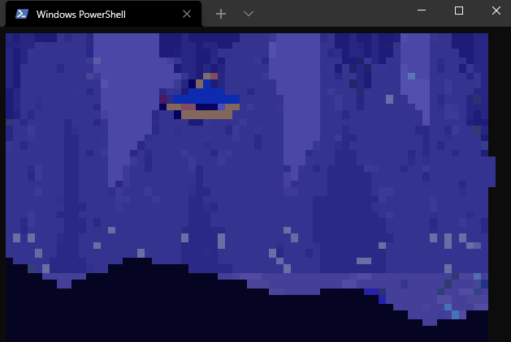
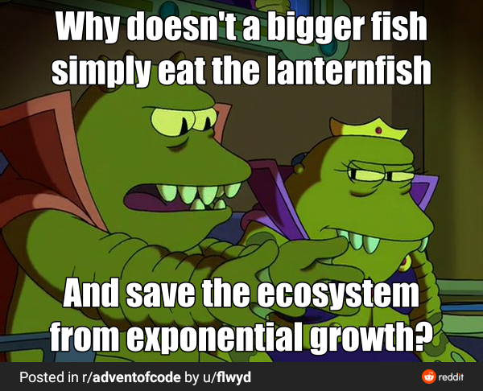
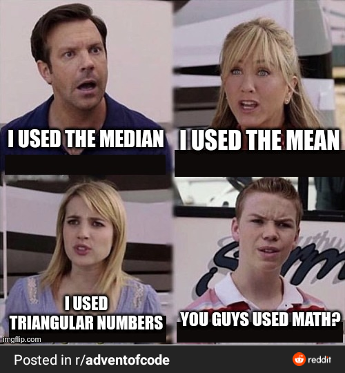
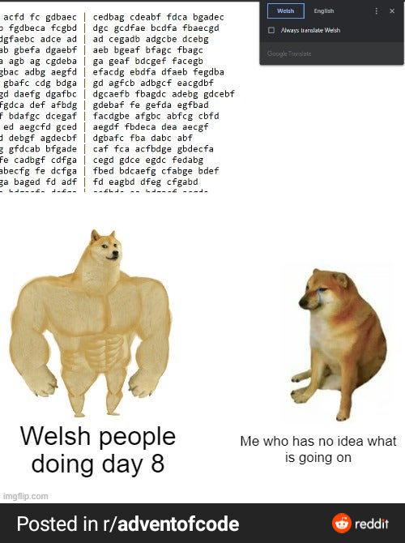
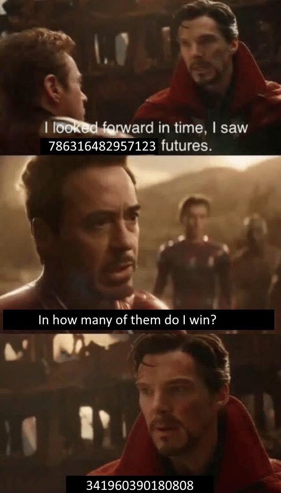

# ⛄️ Advent of Code 2021 🥶

| Day                                            | Title                   | Code                   | Tests                                                      | Tags                                 | Visual                                                                                                                                                        |
|------------------------------------------------|-------------------------|------------------------|------------------------------------------------------------|--------------------------------------|---------------------------------------------------------------------------------------------------------------------------------------------------------------|
| [Day 1](https://adventofcode.com/2021/day/1)   | Sonar Sweep             | [code](day01/Day1.kt)  | [tests](../../../test/kotlin/aoc2021/day01/Day1KtTest.kt)  | list of depths                       |                                                                             |
| [Day 2](https://adventofcode.com/2021/day/2)   | Dive!                   | [code](day02/Day2.kt)  | [tests](../../../test/kotlin/aoc2021/day02/Day2KtTest.kt)  | positions, movements                 |                                                                                     |
| [Day 3](https://adventofcode.com/2021/day/3)   | Binary Diagnostic       | [code](day03/Day3.kt)  | [tests](../../../test/kotlin/aoc2021/day03/Day3KtTest.kt)  | binary numbers, search, bit flip     |                                                                                                                                                               |
| [Day 4](https://adventofcode.com/2021/day/4)   | Giant Squid             | [code](day04/Day4.kt)  | [tests](../../../test/kotlin/aoc2021/day04/Day4KtTest.kt)  | bingo, squid game                    |                                                                                    |
| [Day 5](https://adventofcode.com/2021/day/5)   | Hydrothermal Venture    | [code](day05/Day5.kt)  | [tests](../../../test/kotlin/aoc2021/day05/Day5KtTest.kt)  | cartesian plane, intersections       |                                                                                                                                                               |
| [Day 6](https://adventofcode.com/2021/day/6)   | Lanternfish             | [code](day06/Day6.kt)  | [tests](../../../test/kotlin/aoc2021/day06/Day6KtTest.kt)  | lanternfish, exponential growth      |                                                                                    |
| [Day 7](https://adventofcode.com/2021/day/7)   | The Treachery of Whales | [code](day07/Day7.kt)  | [tests](../../../test/kotlin/aoc2021/day07/Day7KtTest.kt)  | moving crabs, minimum fuel, Gauss    |                                                                                    |
| [Day 8](https://adventofcode.com/2021/day/8)   | Seven Segment Search    | [code](day08/Day8.kt)  | [tests](../../../test/kotlin/aoc2021/day08/Day8KtTest.kt)  | seven segment display                |                                                                                    |
| [Day 9](https://adventofcode.com/2021/day/9)   | Smoke Basin             | [code](day09/Day9.kt)  | [tests](../../../test/kotlin/aoc2021/day09/Day9KtTest.kt)  | basin, flood, local min heights      | [visualisation](https://refined-github-html-preview.kidonng.workers.dev/martapanc/Advent-of-Code/raw/master/src/main/kotlin/aoc2021/day09/render/basins.html) |
| [Day 10](https://adventofcode.com/2021/day/10) | Syntax Scoring          | [code](day10/Day10.kt) | [tests](../../../test/kotlin/aoc2021/day10/Day10KtTest.kt) | parentheses                          |                                                                                                                                                               |
| [Day 11](https://adventofcode.com/2021/day/11) | Dumbo Octopus           | [code](day11/Day11.kt) | [tests](../../../test/kotlin/aoc2021/day11/Day11KtTest.kt) | game of life, flashing octopi        |                                                                                                                                                               |
| [Day 12](https://adventofcode.com/2021/day/12) | Passage Pathing         | [code](day12/Day12.kt) | [tests](../../../test/kotlin/aoc2021/day12/Day12KtTest.kt) | path finding                         |                                                                                                                                                               |
| [Day 13](https://adventofcode.com/2021/day/13) | Transparent Origami     | [code](day13/Day13.kt) | [tests](../../../test/kotlin/aoc2021/day13/Day13KtTest.kt) | 2d coords, origami, flip coordinates |                                                                                                                                                               |
| [Day 14](https://adventofcode.com/2021/day/14) | Extended Polymerization | [code](day14/Day14.kt) | [tests](../../../test/kotlin/aoc2021/day14/Day14KtTest.kt) | polymers, replacements               |                                                                                                                                                               |
| [Day 15](https://adventofcode.com/2021/day/15) | Chiton                  | [code](day15/Day15.kt) | [tests](../../../test/kotlin/aoc2021/day15/Day15KtTest.kt) | risk levels, cheapest path           |                                                                                                                                                               |
| [Day 16](https://adventofcode.com/2021/day/16) | Packet Decoder          | [code](day16/Day16.kt) | [tests](../../../test/kotlin/aoc2021/day16/Day16KtTest.kt) | binary, hex                          |                                                                                                                                                               |
| [Day 17](https://adventofcode.com/2021/day/17) | Trick Shot              | [code](day17/Day17.kt) | [tests](../../../test/kotlin/aoc2021/day17/Day17KtTest.kt) | projectile motion                    |                                                                                                                                                               |
| [Day 18](https://adventofcode.com/2021/day/18) | Snailfish               | [code](day18/Day18.kt) | [tests](../../../test/kotlin/aoc2021/day18/Day18KtTest.kt) | recursive addition                   |                                                                                                                                                               |
| [Day 19](https://adventofcode.com/2021/day/19) | Beacon Scanner          | [code](day19/Day19.kt) | [tests](../../../test/kotlin/aoc2021/day19/Day19KtTest.kt) | 3d coords, translations              |                                                                                                                                                               |
| [Day 20](https://adventofcode.com/2021/day/20) | Trench Map              | [code](day20/Day20.kt) | [tests](../../../test/kotlin/aoc2021/day20/Day20KtTest.kt) | 3d coords, trenches                  |                                                                                                                                                               |
| [Day 21](https://adventofcode.com/2021/day/21) | Dirac Dice              | [code](day21/Day21.kt) | [tests](../../../test/kotlin/aoc2021/day21/Day21KtTest.kt) | dice, 3-side die, multiverse         |                                                                                  |
| [Day 22](https://adventofcode.com/2021/day/22) | Reactor Reboot          | [code](day22/Day22.kt) | [tests](../../../test/kotlin/aoc2021/day22/Day22KtTest.kt) | overlapping cubes                    |                                                                                                                                                               |
| [Day 23](https://adventofcode.com/2021/day/23) | Amphipod                | [code](day23/Day23.kt) | [tests](../../../test/kotlin/aoc2021/day23/Day23KtTest.kt) | move and organize, best path         |                                                                                                                                                               |
| [Day 24](https://adventofcode.com/2021/day/24) | Arithmetic Logic Unit   | [code](day24/Day24.kt) | [tests](../../../test/kotlin/aoc2021/day24/Day24KtTest.kt) | operations, compiler, max & min      |                                                                                                                                                               |
| [Day 25](https://adventofcode.com/2021/day/25) | Sea Cucumber            | [code](day25/Day25.kt) | [tests](../../../test/kotlin/aoc2021/day25/Day25KtTest.kt) | Sea cucumbers moving linearly        |                                                                                                                                                               |
