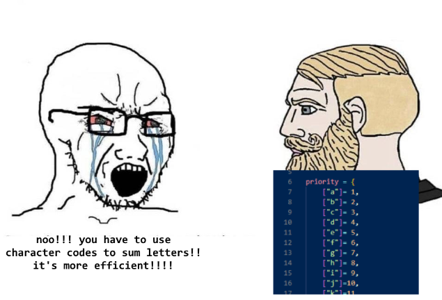
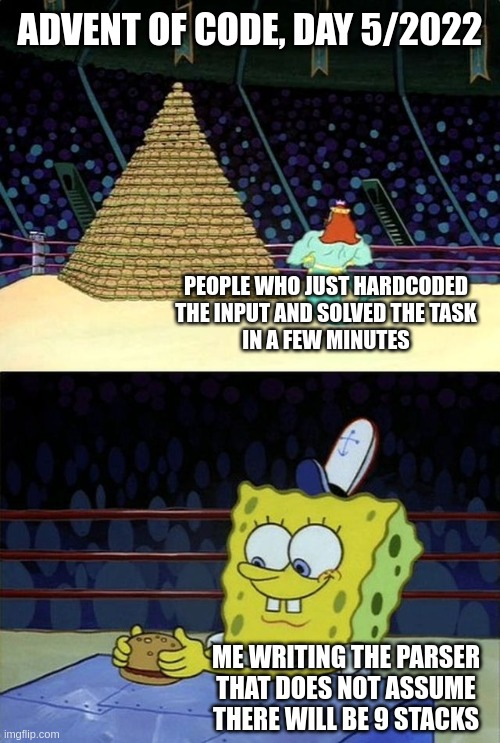
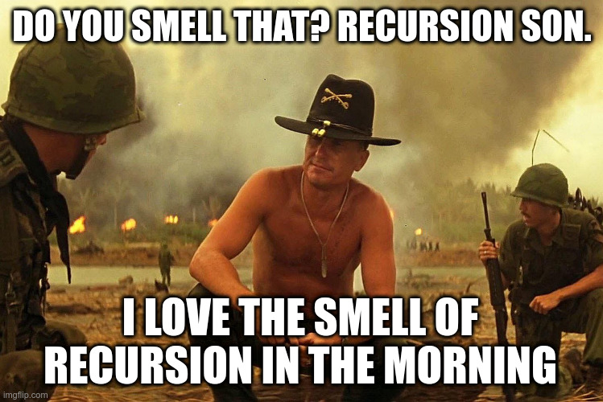
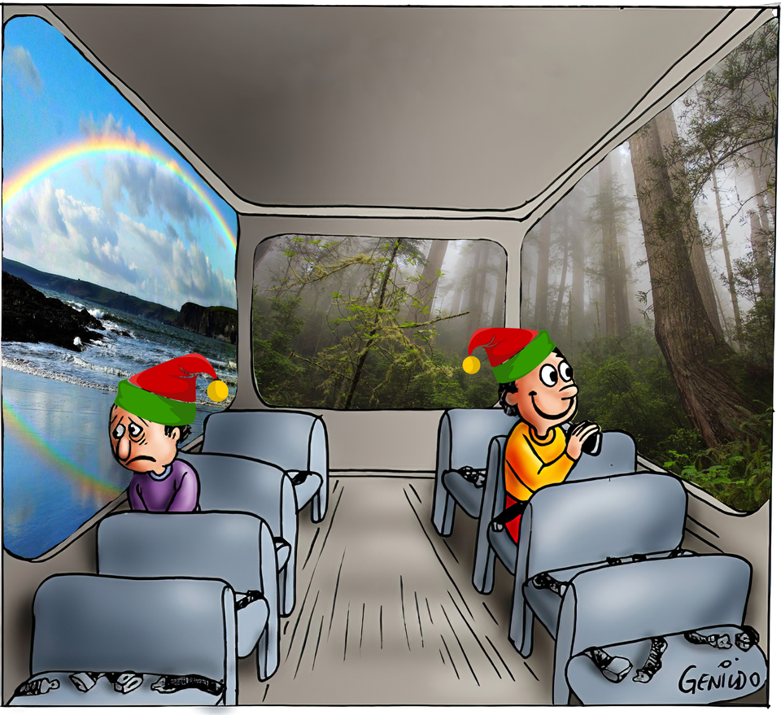
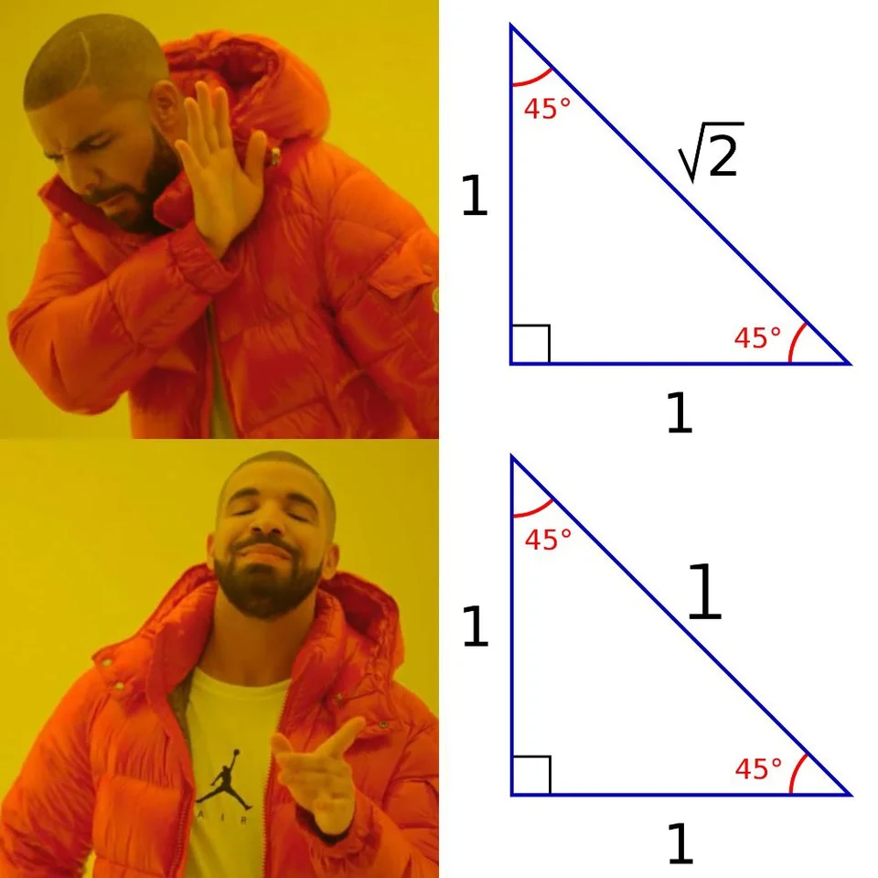
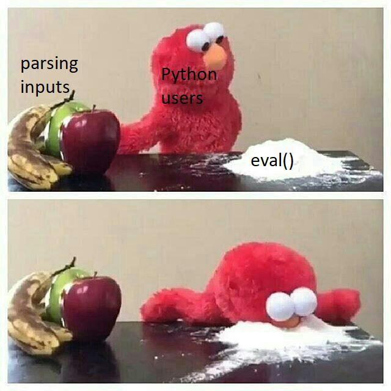

# 🌲🌲🌲 Advent of Code 2022 🌲🌲🌲

| Day                                            | Title                    | Code                   | Tests                                                      | Tags                               | Difficulty | Visual                                                                                                                                                                                                                                                                                                                                                                                     |
|------------------------------------------------|--------------------------|------------------------|------------------------------------------------------------|------------------------------------|------------|--------------------------------------------------------------------------------------------------------------------------------------------------------------------------------------------------------------------------------------------------------------------------------------------------------------------------------------------------------------------------------------------|
| [Day 1](https://adventofcode.com/2022/day/1)   | Calorie Counting         | [code](day01/Day1.kt)  | [tests](../../../test/kotlin/aoc2022/day01/Day1KtTest.kt)  | list of ints, 1st 2nd and 3rd max  | ❄️         |                                                                                                                                                                                                                                                                                                                                                                                            |
| [Day 2](https://adventofcode.com/2022/day/2)   | Rock Paper Scissors      | [code](day02/Day2.kt)  | [tests](../../../test/kotlin/aoc2022/day02/Day2KtTest.kt)  | win-draw-lose strategy             | ❄️         |                                                                                                                                                                                                                                                                                                                |
| [Day 3](https://adventofcode.com/2022/day/3)   | Rucksack Reorganization  | [code](day03/Day3.kt)  | [tests](../../../test/kotlin/aoc2022/day03/Day3KtTest.kt)  | find common chars                  | ❄️         |                                                                                                                                                                                                                                                                                                                 |
| [Day 4](https://adventofcode.com/2022/day/4)   | Camp Cleanup             | [code](day04/Day4.kt)  | [tests](../../../test/kotlin/aoc2022/day04/Day4KtTest.kt)  | overlapping range of ints          | ❄️         |                                                                                                                                                                                                                                                                                                                                                                                            |
| [Day 5](https://adventofcode.com/2022/day/5)   | Supply Stacks            | [code](day05/Day5.kt)  | [tests](../../../test/kotlin/aoc2022/day05/Day5KtTest.kt)  | stacks, move w/ or w/o order       | ❄️         |                                                                                                                                                                                                                                                                                                                 |
| [Day 6](https://adventofcode.com/2022/day/6)   | Tuning Trouble           | [code](day06/Day6.kt)  | [tests](../../../test/kotlin/aoc2022/day06/Day6KtTest.kt)  | first n unique chars in string     | ❄️         |                                                                                                                                                                                                                                                                                                                                                                                            |
| [Day 7](https://adventofcode.com/2022/day/7)   | No Space Left On Device  | [code](day07/Day7.kt)  | [tests](../../../test/kotlin/aoc2022/day07/Day7KtTest.kt)  | nested dirs size, free up space    | ❄️❄️❄️     |                                                                                                                                                                                                                                                                                                                 |
| [Day 8](https://adventofcode.com/2022/day/8)   | Treetop Tree House       | [code](day08/Day8.kt)  | [tests](../../../test/kotlin/aoc2022/day08/Day8KtTest.kt)  | trees, visible trees, scenic score | ❄️❄️       |  [input](https://refined-github-html-preview.kidonng.workers.dev/martapanc/Advent-of-Code/raw/master/src/main/kotlin/aoc2022/day08/render/input.html) / [output](https://refined-github-html-preview.kidonng.workers.dev/martapanc/Advent-of-Code/raw/master/src/main/kotlin/aoc2022/day08/render/output.html) |
| [Day 9](https://adventofcode.com/2022/day/9)   | Rope Bridge              | [code](day09/Day9.kt)  | [tests](../../../test/kotlin/aoc2022/day09/Day9KtTest.kt)  | rope, tail follows head            | ❄️❄️       |  [part 1](https://refined-github-html-preview.kidonng.workers.dev/martapanc/Advent-of-Code/raw/master/src/main/kotlin/aoc2022/day09/render/part1.html) / [part 2](https://refined-github-html-preview.kidonng.workers.dev/martapanc/Advent-of-Code/raw/master/src/main/kotlin/aoc2022/day09/render/part2.html) |
| [Day 10](https://adventofcode.com/2022/day/10) | Cathode-Ray Tube         | [code](day10/Day10.kt) | [tests](../../../test/kotlin/aoc2022/day10/Day10KtTest.kt) | register, cycles                   | ❄️❄️       |                                                                                                                                                                                                                                                                                                                                                                                            |
| [Day 11](https://adventofcode.com/2022/day/11) | Monkey in the Middle     | [code](day11/Day11.kt) | [tests](../../../test/kotlin/aoc2022/day11/Day11KtTest.kt) | loop between monkeys, mod, lcm     | ❄️❄️       |                                                                                                                                                                                                                                                                                                                                                                                            |              
| [Day 12](https://adventofcode.com/2022/day/12) | Hill Climbing Algorithm  | [code](day12/Day12.kt) | [tests](../../../test/kotlin/aoc2022/day12/Day12KtTest.kt) | bfs, best path, multiple starts    | ❄️❄️       | [input](https://refined-github-html-preview.kidonng.workers.dev/martapanc/Advent-of-Code/raw/master/src/main/kotlin/aoc2022/day12/render/input.html)                                                                                                                                                                                                                                       |                                              
| [Day 13](https://adventofcode.com/2022/day/13) | Distress Signal          | [code](day13/Day13.kt) | [tests](../../../test/kotlin/aoc2022/day13/Day13KtTest.kt) | lists, compare values, recursion,  | ❄️❄️️❄️    |                                                                                                                                                                                                                                                                                                                              |
| [Day 14](https://adventofcode.com/2022/day/14) | Regolith Reservoir       | [code](day14/Day14.kt) | [tests](../../../test/kotlin/aoc2022/day14/Day14KtTest.kt) | sand falling, obstacles, rules     | ❄️❄️       | [part 1](https://refined-github-html-preview.kidonng.workers.dev/martapanc/Advent-of-Code/raw/master/src/main/kotlin/aoc2022/day14/render/part1.html) / [part 2](https://refined-github-html-preview.kidonng.workers.dev/martapanc/Advent-of-Code/raw/master/src/main/kotlin/aoc2022/day14/render/part2.html)                                                                              |
| [Day 15](https://adventofcode.com/2022/day/15) | Beacon Exclusion Zone    | [code](day15/Day15.kt) | [tests](../../../test/kotlin/aoc2022/day15/Day15KtTest.kt) | coords, intersections              | ❄️❄️️❄️    |                                                                                                                                                                                                                                                                                                                                                                                            |
| [Day 16](https://adventofcode.com/2022/day/16) | Proboscidea Volcanic     | [code](day16/Day16.kt) | [tests](../../../test/kotlin/aoc2022/day16/Day16KtTest.kt) | nodes, best path                   | ❄️❄️️❄️❄️️ |                                                                                                                                                                                                                                                                                                                                                                                            |
| [Day 17](https://adventofcode.com/2022/day/17) | Pyroclastic Flow         | [code](day17/Day17.kt) | [tests](../../../test/kotlin/aoc2022/day17/Day17KtTest.kt) | Basically Tetris, modulo           | ❄️❄️️❄️    | [output](https://refined-github-html-preview.kidonng.workers.dev/martapanc/Advent-of-Code/raw/master/src/main/kotlin/aoc2022/day17/renders/output1.html) / [just me having fun I guess](https://refined-github-html-preview.kidonng.workers.dev/martapanc/Advent-of-Code/raw/master/src/main/kotlin/aoc2022/day17/renders/output2.html)                                                    |
| [Day 18](https://adventofcode.com/2022/day/18) | Boiling Boulders         | [code](day18/Day18.kt) | [tests](../../../test/kotlin/aoc2022/day18/Day18KtTest.kt) | 3d coord, total visible surface    | ❄️❄️️      |                                                                                                                                                                                                                                                                                                                                                                                            |
| [Day 19](https://adventofcode.com/2022/day/19) | Not Enough Minerals      | [code](day19/Day19.kt) | [tests](../../../test/kotlin/aoc2022/day19/Day19KtTest.kt) | mining materials, best path        | ❄️❄️️❄️❄️️ |                                                                                                                                                                                                                                                                                                                                                                                            |
| [Day 20](https://adventofcode.com/2022/day/20) | Grove Positioning System | [code](day20/Day20.kt) | [tests](../../../test/kotlin/aoc2022/day20/Day20KtTest.kt) | continuous list, move fw and bw    | ❄️❄️️❄️    |                                                                                                                                                                                                                                                                                                                                                                                            |

[//]: # (| [Day 21]&#40;https://adventofcode.com/2022/day/21&#41; | Dirac Dice              | [code]&#40;day21/Day21.kt&#41; | [tests]&#40;../../../test/kotlin/aoc2022/day21/Day21KtTest.kt&#41; | dice, 3-side die, multiverse         |                                                                                  |)

[//]: # (| [Day 22]&#40;https://adventofcode.com/2022/day/22&#41; | Reactor Reboot          | [code]&#40;day22/Day22.kt&#41; | [tests]&#40;../../../test/kotlin/aoc2022/day22/Day22KtTest.kt&#41; | overlapping cubes                    |                                                                                                                                                               |)

[//]: # (| [Day 23]&#40;https://adventofcode.com/2022/day/23&#41; |                         | [code]&#40;day23/Day23.kt&#41; | [tests]&#40;../../../test/kotlin/aoc2022/day23/Day23KtTest.kt&#41; |                                      |                                                                                                                                                               |)

[//]: # (| [Day 24]&#40;https://adventofcode.com/2022/day/24&#41; |                         | [code]&#40;day24/Day24.kt&#41; | [tests]&#40;../../../test/kotlin/aoc2022/day24/Day24KtTest.kt&#41; |                                      |                                                                                                                                                               |)

[//]: # (| [Day 25]&#40;https://adventofcode.com/2022/day/25&#41; | Sea Cucumber            | [code]&#40;day25/Day25.kt&#41; | [tests]&#40;../../../test/kotlin/aoc2022/day25/Day25KtTest.kt&#41; | Sea cucumbers moving linearly        |                                                                                                                                                               |)
